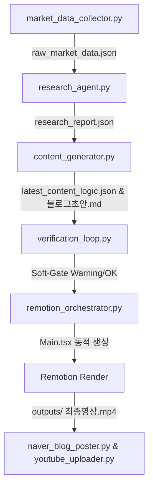

# 📑 SW Design Specification: Automation Pipeline Improvements

- **작성일**: 2026-06-03
- **상태**: APPROVED (설계 승인 완료)
- **주요 대상**: Remotion 동적 대본 반영, 소프트 게이트 구현, 환경 설정 유연성 및 버그 수정

---

## 1. 아키텍처 및 데이터 흐름 (Architecture & Data Flow)

개선된 시스템은 아래 그림과 같이 데이터 수집 ➔ 리서치 ➔ 기획 ➔ 소프트 게이트 검증 ➔ 미디어 합성(Remotion) ➔ 자동 발행의 흐름으로 진행됩니다.

---

## 2. 컴포넌트별 세부 설계 (Component Specification)

### 2.1 Remotion 동적 대본 반영 (`remotion_orchestrator.py`)
- **기존 문제**: `Main.tsx` 파일 내의 자막 텍스트와 씬 논리가 실제 AI가 생성한 오늘의 대본 대신 고정된 경제 기사로 하드코딩되어 동작함.
- **해결 설계**:
  - `update_remotion_sources(durations)`가 호출될 때 `data/latest_content_logic.json`을 직접 파싱합니다.
  - JSON 내의 `video_structure` (씬 번호, 씬 제목, 핵심 논리, 자막 레이아웃)를 추출합니다.
  - 추출한 자막 레이아웃(예: `"라인1 / 라인2"`)을 기반으로 `Main.tsx` 파일의 씬 컴포넌트 텍스트 영역을 템플릿 치환 또는 정적 문자열 빌드 방식으로 동적 수정 후 저장합니다.

### 2.2 `REMOTION_DIR` 환경 변수 이식성 확보
- **기존 문제**: 로컬 드라이브의 절대 경로가 하드코딩되어 협업 환경 및 다른 빌드 서버에서 실행되지 않음.
- **해결 설계**:
  - `REMOTION_DIR = os.getenv("REMOTION_DIR", r"D:\04_Antigravity_wp\Remotion")` 형태로 변경하여 `.env` 설정을 우선적으로 조회하게 합니다.

### 2.3 팩트체크 '소프트 게이트(Soft-Gate)' 전환
- **기존 문제**: 수치 포맷(반올림, 쉼표 표기 등)의 사소한 불일치로 인해 팩트체크 검증에서 `FAILED` 판정이 날 경우 파이프라인 전체가 강제 중단되어 비디오 렌더링이나 발행이 아예 불가능함.
- **해결 설계**:
  - `generation_pipeline.py` 및 `main.py` 내의 `sys.exit(1)` 처리 구문을 `sys.exit(0)`(또는 계속 진행)으로 변경합니다.
  - 검증 단계 실패 시 콘솔 및 GUI 로그 창에 큰 경고 문구(⚠️)를 노출하되, 흐름은 막지 않고 다음 단계(미디어 생성 및 발행)를 계속할 수 있도록 제어 흐름을 완화합니다.

### 2.4 네이버 블로그 본문 3,000자 절단 제한 해제 (`naver_blog_poster.py`)
- **기존 문제**: HTML 태그를 포함하여 본문 내용이 3,000자에서 슬라이싱되면서 원고의 후반부가 손실됨.
- **해결 설계**:
  - `body_html[:3000]`으로 처리된 글자수 슬라이싱 제약을 제거하거나, 넉넉한 글자수(예: `body_html[:50000]`)로 변경하여 생성된 원고가 손실 없이 전체 포스팅되도록 수정합니다.

### 2.5 `back_data_trends` dict 프롬프트 자연어 정제 (`content_generator.py`)
- **기존 문제**: `back_data_trends`의 원본 JSON dict 구조가 여과 없이 AI 프롬프트에 그대로 노출되어 프롬프트 품질 및 AI 결과 안정성을 저해함.
- **해결 설계**:
  - `_load_research_context()`에서 `back_data_trends`의 타입이 `dict`인 경우, 자연어 요약 통계 텍스트로 가독성 있게 포맷팅하여 프롬프트에 결합합니다.

### 2.6 `market_data_collector.py` NameError 버그 조치
- **기존 문제**: 예외가 터질 시 `r` 객체가 선언되지 않은 상태에서 fallback 블록의 `r.text`를 파싱하려다 NameError 발생 가능성 있음.
- **해결 설계**:
  - `r = None`을 try문 진입 전 선언하여 변수의 유효 범위(Scope)를 안정화시킵니다.

---

## 3. 테스트 및 검증 방안 (Testing & Verification)

1. **구문 검사**: 수정 후 전 파이썬 모듈을 대상으로 `py_compile`을 수행하여 구문 오류가 없는지 테스트합니다.
2. **단위 테스트**: `remotion_orchestrator.py`를 단독 실행하여 `Main.tsx`가 오늘의 실시간 대본 텍스트로 동적 재생성되는지 파일 변경 내역을 관찰합니다.
3. **전체 통합 테스트**: GUI 및 파이프라인 전체를 구동하여 팩트 검증 오류 경고가 떠도 동영상 제작과 발행이 막히지 않고 자연스럽게 다음 단계로 파이핑되는지 실시간 로그로 최종 확인합니다.
