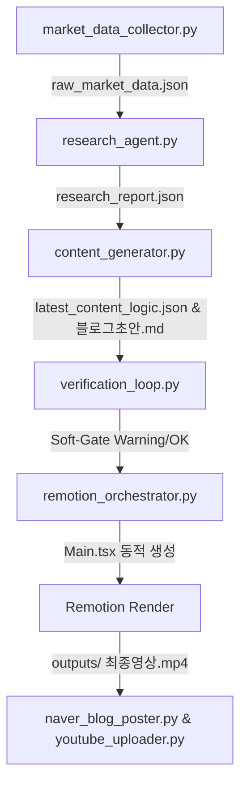

# 📑 SW Design Specification: Automation Pipeline Improvements (Revised v2)

- **작성일**: 2026-06-03
- **상태**: APPROVED (최종 피드백 반영 완료)
- **주요 대상**: Remotion 가변 동적 대본 반영, 소프트 게이트 구현, 환경 설정 유연성 및 버그 수정

---

## 1. 아키텍처 및 데이터 흐름 (Architecture & Data Flow)

개선된 시스템은 아래 그림과 같이 데이터 수집 ➔ 리서치 ➔ 기획 ➔ 소프트 게이트 검증 ➔ 미디어 합성(Remotion) ➔ 자동 발행의 흐름으로 진행됩니다.

---

## 2. 컴포넌트별 세부 설계 (Component Specification)

### 2.1 Remotion 가변 동적 대본 반영 (`remotion_orchestrator.py`)
- **기존 문제**: `Main.tsx` 파일 내의 자막 텍스트와 씬 논리가 실제 AI가 생성한 오늘의 대본 대신 고정된 5개 씬의 경제 기사로 하드코딩되어 동작함.
- **해결 설계**:
  - `video_structure`의 씬 수(5~10개)가 유동적이므로, 고정된 컴포넌트 구조 대신 **가변 씬 수에 관계없이 동적으로 TSX 컴포넌트 코드를 조립**하여 `Main.tsx`를 통째로 덮어쓰는 구조로 리팩토링합니다.
  - 씬 컴포넌트명은 `Scene1`, `Scene2`, `Scene3`... 와 같이 씬의 개수에 맞춰 자동 생성하도록 `update_remotion_sources()` 함수를 확장 구현합니다.
  - 각 씬의 자막(`caption_layout`) 및 텍스트 데이터가 해당 씬 컴포넌트에 올바르게 주입되도록 템플릿 코드 생성기를 설계합니다.
  - **자막 포맷 처리**: `"라인1 / 라인2"` 형태로 들어오는 문자열은 `/` 문자를 기준으로 분리하여 TSX(JSX) 렌더링 시 ` ` 태그 또는 개별 `
` 요소로 줄바꿈 처리되도록 합니다.
  - **특수문자 이스케이프**: JSX 템플릿 내에 한국어 특수문자나 따옴표(`"`, `'`), 중괄호(`{`, `}`) 등이 포함될 수 있으므로, 치환 과정에서 JS/TSX 구문 에러를 방지하기 위해 특수문자 이스케이프 처리를 철저히 설계합니다.

### 2.2 `REMOTION_DIR` 환경 변수 관리 및 `.env` 명세
- **기존 문제**: 로컬 드라이브의 절대 경로가 하드코딩되어 협업 환경 및 다른 빌드 서버에서 실행되지 않음.
- **해결 설계**:
  - `REMOTION_DIR = os.getenv("REMOTION_DIR", r"D:\04_Antigravity_wp\Remotion")` 형태로 변경하여 `.env` 설정을 우선적으로 조회하게 합니다.
  - `.env` 파일 및 예시 템플릿에 `REMOTION_DIR` 키값을 공식 등록하고, 환경 설정 가이드에 기재합니다.

### 2.3 팩트체크 '소프트 게이트(Soft-Gate)' 전환
- **기존 문제**: 수치 포맷(반올림, 쉼표 표기 등)의 사소한 불일치로 인해 팩트체크 검증에서 `FAILED` 판정이 날 경우 파이프라인 전체가 강제 중단되어 비디오 렌더링이나 발행이 아예 불가능함.
- **해결 설계**:
  - [main.py](file:///D:/01_formyself/AutoContents/main.py) (L119-L123) 및 [src/generation_pipeline.py](file:///D:/01_formyself/AutoContents/src/generation_pipeline.py) 내의 `sys.exit(1)` 처리 구문을 제거하거나 무효화합니다.
  - 팩트 검증에서 `FAILED`가 검출되어도 화면이나 로그창에 경고(⚠️)만 크게 출력한 뒤, 렌더링(Phase 5) 및 발행 단계로 넘어갈 수 있도록 소프트 게이트로 흐름 제어 규칙을 완화합니다.

### 2.4 네이버 블로그 본문 3,000자 절단 제한 완화 (`naver_blog_poster.py`)
- **기존 문제**: HTML 태그를 포함하여 본문 내용이 3,000자에서 슬라이싱되면서 원고의 후반부가 손실됨.
- **해결 설계**:
  - [src/naver_blog_poster.py](file:///D:/01_formyself/AutoContents/src/naver_blog_poster.py) L164의 `body_html[:3000]` 강제 슬라이싱 코드를 `body_html[:50000]`으로 변경하여 원고 본문 전체가 손실 없이 정상 포스팅되도록 보장합니다.

### 2.5 `back_data_trends` 자연어 포맷팅 개선
- **기존 문제**: `back_data_trends`의 원본 JSON dict 구조가 여과 없이 AI 프롬프트에 그대로 노출되어 프롬프트 품질 및 AI 결과 안정성을 저해함.
- **해결 설계**:
  - `src/research_agent.py` 내의 `generate_fact_sheet()`에서 활용하는 백데이터 포맷팅 방식을 모듈화하거나 유사하게 구현하여, `content_generator.py` 내 `_load_research_context()`에서 `back_data_trends`를 가독성 높은 자연어 텍스트로 치환해 프롬프트에 제공합니다.

### 2.6 `market_data_collector.py` NameError 버그 조치
- **기존 문제**: 예외가 터질 시 `r` 객체가 선언되지 않은 상태에서 fallback 블록의 `r.text`를 파싱하려다 NameError 발생 가능성 있음.
- **해결 설계**:
  - `r = None`을 try문 진입 전 선언하여 변수의 유효 범위(Scope)를 안정화시킵니다.

### 2.7 추가 발견 누락 항목 조치
- **A. `propose_topics()` except 블록 변수 참조 오류**:
  - [src/content_generator.py](file:///D:/01_formyself/AutoContents/src/content_generator.py) 내에서 정의되지 않은 `selected_topic` 참조를 제거하고 일반 실패 문자열로 안전하게 복구합니다.
- **B. `gui_main.py` 레이블 레이아웃 배치 오류**:
  - `lbl_topic_status` 레이블이 주제 콤보박스 옆이 아니라 줄바꿈 없이 이상하게 배치되던 Tkinter grid/pack 레이아웃 코드를 정비합니다.
- **C. `content_generator.py` 중복 주석 제거**:
  - L163-164 근처의 중복 선언된 주석 라인을 깔끔하게 한 줄로 합칩니다.

---

## 3. 테스트 및 검증 방안 (Testing & Verification)

1. **구문 검사**: 수정 후 전 파이썬 모듈을 대상으로 `py_compile`을 수행하여 구문 오류가 없는지 테스트합니다.
2. **단위 테스트**: `remotion_orchestrator.py`를 단독 실행하여 `Main.tsx`가 5~10씬 사이의 가변 대본 구조에 맞춰 완전 자동 생성되는지 파일 변경 내역을 검증합니다.
3. **전체 통합 테스트**: GUI 및 파이프라인 전체를 구동하여 팩트 검증 오류 경고가 떠도 동영상 제작과 발행이 막히지 않고 자연스럽게 다음 단계로 파이핑되는지 실시간 로그로 최종 확인합니다.

---

## 4. 권장 수행 단계 (Execution Steps)

1. **1단계 (버그 및 환경설정)**: 2.6 (Collector NameError), 2.7-A (Propose NameError), 2.2 (Remotion Env), 2.3 (Soft-Gate), 2.4 (Blog Clip)
2. **2단계 (품질 및 UI)**: 2.5 (Back data formatting), 2.7-B (GUI Label Layout), 2.7-C (Duplicated comment)
3. **3단계 (핵심 기능)**: 2.1 (Remotion Dynamic TSX Generation)
